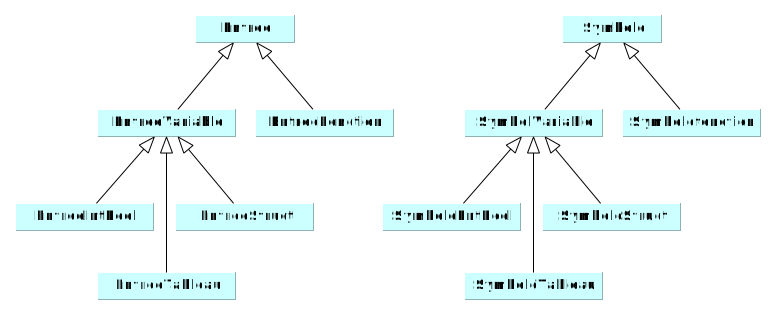
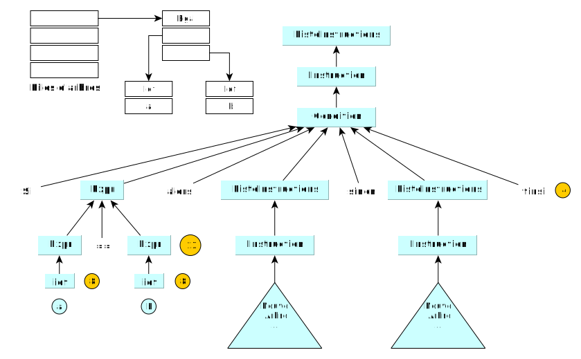
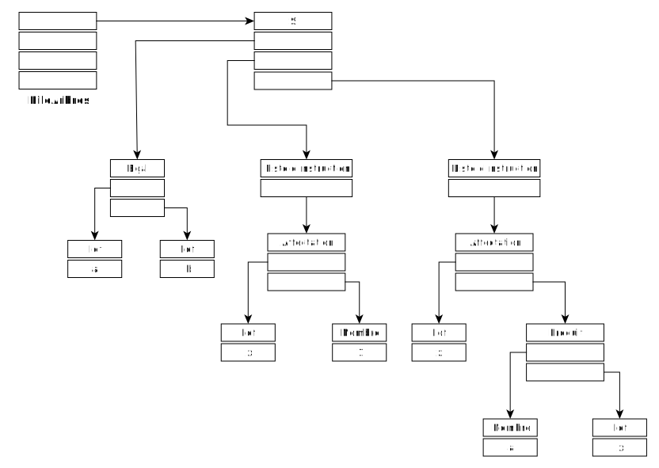

# Méthode de compilation

## Gestionnaire d'erreur

Le fait d'avoir un gestionnaire d'erreur permet de poursuivre la détection de nouvelles erreurs sans arrêter la compilation dès la première erreur rencontrée. 

## Table des symboles

- Entrée: identificateur
- Symbole: contient le no de ligne, la valeur, et toutes autres informations liées à la déclaration. 

### Construction de la TDS

A chaque déclaration, on ajoute une nouvelle entrée dans la table des symboles. 

#### Classe TDS

```java
class TDS{ // doit être une instance unique (singleton pattern)
    private static TDS instance = new TDS();
  
    // permet d'utiliser l'unique instance 
    static TDS getInstance();
  
    // Peut retourner l'erreur double déclaration. 
    int ajouter(Entrée, Symbole);  // ajoute dans le bloc courant. sous réserve des blocs ouverts

    // retourne un symbole ou null
    String identifier(Entrée);

    // permet d'entrer/sortir d'un bloc
    void entreeBloc();
    void sortieBloc();  
}
```

#### Classes Entrée/Symboles

__L'entrée__ correspond à l'identificateur de la dernière unité lexicale reconnue. Par ex dans: 

booleen monBool = true;   // L'entrée serait "monBool", reconnue sous une unité lexicale booléenne. 

__Un symbole__ contient touts les informations attachées à la déclaration de "monBool". Numéro de ligne, valeur, type, etc... 





#### Exemples CUP et interface TDS

```
BLOC  -> debut (1) LDECV LINS (2) fin
LDECV -> DECL LDECV
		| NULL
DECL  -> TYPE ident (3) ';'
		| TYPE (4) ident (PARAM) debut LDECV LINS (6) fin
PARAM -> TYPE(4) ident (7) SUITE_PARAM
		| NULL
SUITE_PARAM -> ',' TYPE (4) ident (7) SUITE_PARAM
		| NULL
TYPE   -> boolean (8)
		| entier (9)
```

```java
// 1
Tds.getInstance().entreeBloc();
// 2
Tds.getInstance().sortieBloc();
// 3
Entree e = new EntreeEntBool ( new Ident(uniteCourante));
Symbole s = new SymboleEntBool(ligne, lastType);
Tds.getInstance().ajouter(e,s);
// 4 
Type t = lastType;
// 5
Ident ifonc = new Ident(uniteCourante);
Tds.getInstance().entreeBloc()
lastParam = new Parametres(spf);
// 6
Tds.getInstance().sortieBloc();
Entree em = new EntreeMethode(ifonc, lastParam);
Symbole sm = new SymboleMethode(ligne, t, lastParam);
Tds.getInstance().ajouter(em,sm);
// 7
Ident ipf = new Ident(uniteCourante);
Entree epf = new EntreeVarLocPar(ipf);
Symbole spf = new SymboleVarPar(ligne, t);
lastParam.ajouter(spf);
Tds.getInstance().ajouter(epf,spf);
// 8 
lastType = TypeBooleen.getInstance();
// 9
lastType = TypeEntier.getInstance();
```

#### Implémentation de TDS

- Utiliser un dictionnaire <symbole, bloc> et une pile<bloc>

#### Classe Type

```java
public abstract class Type {
/** Conformite de 2 types
* @param: other un autre type
* @return: vrai si this est conforme $ other
*/
public abstract boolean estConforme( Type other );
} // class Type

public class TypeEntier extends Type {
  public boolean estConforme(Type other) {
  	return other instanceof TypeEntier;
  } // estConforme
} // TypeEntier
```


## Abre abstrait

- Conceptionné avec le composite pattern
- Un arbre est construit à chaque réduction d'une règle. 
- Lorsqu'une instruction se passe bien (dérivation), l'arbre abstrait de l'instruction est construit et accessible. L'abre est rangé dans la __pile des arbres__
- L'analyse réussie de chaque non terminal entraine l'empilement de l'arbre abstrait correspondant. A la fin de l'analyse, la pile ne contient plus qu'un seul arbre: celui du texte complet. 


### Classes d'expressions


### Classes d'instructions


### Exemples: 

Affectation:

```
INSTR -> AFFECTATION
AFFECTATION -> ACCES '=' EXPR ';'
```

```java
Expr source = (Expr) (pilesArbres.depiler());
Ident dst = (Ident) (pilesArbres.depiler());
pileArbres.empiler(new Affectation(dst, src));
```

Condition: 

```
INSTR --> CONDITION
CONDITION -> si EXPR alors LINSTR sinon LINSTR finsi (4)
			| si EXPR alors LINSTR finsi (5)
```

```java
/*(4)*/ Linstr sinon = (Linstr) (pilesArbres.depiler());
        Linstr alors = (Linstr) (pilesArbres.depiler());
        Expr ec = (Expr) (pilesArbres.depiler());
        pileArbres.empiler(new Si(ec, alors, sinon));
/*(5)*/ Linstr alors = (Linstr) (pilesArbres.depiler());
        Expr ec = (Expr) (pilesArbres.depiler());
        pileArbres.empiler(new Si(ec, alors, null));
```

Expression _(arithmétique binaire)_

```
EXPR	-> EXPR OPBIN EXPR (6)
			| OPERANDE
```

#### Exemple à partir d'un code

```java
si (a == b) alors 
	x = 1 
sinon 
	x = 3 * x 
finsi
```


1.  On réduit/détecte/empile les identifiants _a_ et _b_.  On réduit/détecte/empile l'expression Egal en dépilant les identifiants _a_ et _b_. On final, on se retrouve avec l'expression _egal_ en haut de la pile d'arbre. 

```java
   /*(8)*/ // depiler a et b
   		String nom = (String) pileArbres.depiler(); 
   		String nom = (String) pileArbres.depiler(); 
        // empile a et b sous forme d'identifiant		
        pileArbres.empiler(new Ident(nom)); 
   		pileArbres.empiler(new Ident(nom)); 

   /*(13)*/// depiler a et b cast (expr)
   		Expr operandeDroite = (Expr) pileArbres.depiler(); 
   		Expr operandeGauche = (Expr) pileArbres.depiler();
   		// empiler Expr Egal
   		pileArbres.empiler(new Egal(operandeGauche, operandeDroite)); 
```

   

2. On réduit/détecte/empile l'expression _alors_, puis, ensuite l'expression _sinon_. On se retrouvera avec cet arbre abstrait à la fin 

   

# Syntaxe du langage Hepial

```
programme identifiant
	DECLARATIONS VARIABLES / FONCTIONS
debutprg
	INSTRUCTIONS*
finprg
```

### Types possibles 

- entier
- booleen


### Déclarations

#### Constantes

```
constante entier ident = 3;
constante entier ident = (3+5);
constante booleen ident = vrai;
constante booleen ident = faux;
```

#### Variables

```
booleen ident;
entier ident1, ident2, ident3;
```

#### Tableaux

_entiers et booleens_

```
entier ident [(2+3) .. 10]; // tab[5], tab[6], tab[7], tab[8], tab[9], tab[10]
entier ident [(4+3), 3..4]; // deux dimensions
boolean ident [7 .. 9];
entier ident [ fct1() .. ident1 ];
entier ident [ tab[1] .. (9+1)];
```

#### Manipulations de variables

```
maVar = var2;
maVar = tab[1];
tab[3] = 4;
mavVar = 56;
```

#### Conditions

```
si EXPRESSION alors
	CORPS
sinon 
	COPRS
finsi
```

#### Boucles

```
// while
tantque EXPRESSION faire
	CORPS
fintantque

// for
pour ident allentde EXPR a EXPR faire
	CORPS
finpour
```

### Fonctions

```
entier maFonction( booleen param1, entier param2 )
	entier declaVar1;
	boolen declaVar2[0..1];
debutfonc
	INSTRUCTIONS*
	(retour EXPR)+
finfonc
```

#### Fonctions systèmes? 

 ```
lire maVar; // équivaut à maVar = scan(); ? 
ecrire maVar; // équivaut à print(maVar); ?
ecrire "ceci est une chaine de caractères \" avec un guilllemet au milieu";
 ```


# Questions:

- Tableaux?
- CORPS: la grammaire empêche de déclarer des variables dans un corps. C'est juste non? Du coup la portée ne concerne que les affectations? 
