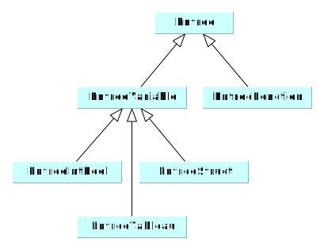

# Méthode de compilation

## Gestionnaire d'erreur

Le fait d'avoir un gestionnaire d'erreur permet de poursuivre la détection de nouvelles erreurs sans arrêter la compilation dès la première erreur rencontrée. 

## Table des symboles

- Sorte de table où sont repertoriées les variables déclarées. Intégrer la notion de portée. 
- On doit enregistrer les numéros de lignes
- Un symbole contient donc: 
  - numéro de ligne dans laquelle il est déclaré
  - valeur, 
  - l'entrée
  - ​

#### Opérations

```java
class TDS{ // doit être une instance unique (singleton pattern)
  	// permet d'utiliser l'unique instance 
  	static TDS getInstance();
  
  	// Peut retourner l'erreur double déclaration. 
    int ajouter(table, entrée, valeur);

    // retourne un symbole ou null
    String identifier(table, entrée);

    // permet d'entrer/sortir d'un bloc
    void entreeBloc(table);
    void sortieBloc(table);  
}
```

#### Classe Entrée




# Syntaxe du langage Hepial

```
programme identifiant
	DECLARATIONS VARIABLES / FONCTIONS
debutprg
	INSTRUCTIONS*
finprg
```

### Types possibles 

- entier
- booleen


### Déclarations

#### Constantes

```
constante entier ident = 3;
constante entier ident = (3+5);
constante booleen ident = vrai;
constante booleen ident = faux;
```

#### Variables

```
booleen ident;
entier ident1, ident2, ident3;
```

#### Tableaux

_entiers et booleens_

```
entier ident [(2+3) .. 10]; // tab[5], tab[6], tab[7], tab[8], tab[9], tab[10]
entier ident [(4+3), 3..4]; // deux dimensions
boolean ident [7 .. 9];
entier ident [ fct1() .. ident1 ];
entier ident [ tab[1] .. (9+1)];
```

#### Manipulations de variables

```
maVar = var2;
maVar = tab[1];
tab[3] = 4;
mavVar = 56;
```

#### Conditions

```
si EXPRESSION alors
	CORPS
sinon 
	COPRS
finsi
```

#### Boucles

```
// while
tantque EXPRESSION faire
	CORPS
fintantque

// for
pour ident allentde EXPR a EXPR faire
	CORPS
finpour
```

### Fonctions

```
entier maFonction( booleen param1, entier param2 )
	entier declaVar1;
	boolen declaVar2[0..1];
debutfonc
	INSTRUCTIONS*
	(retour EXPR)+
finfonc
```

#### Fonctions systèmes? 

 ```
lire maVar; // équivaut à maVar = scan(); ? 
ecrire maVar; // équivaut à print(maVar); ?
ecrire "ceci est une chaine de caractères \" avec un guilllemet au milieu";
 ```


# Questions:

- Tableaux?
- CORPS: la grammaire empêche de déclarer des variables dans un corps. C'est juste non? Du coup la portée ne concerne que les affectations? 
